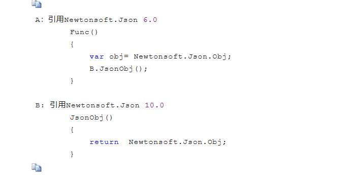
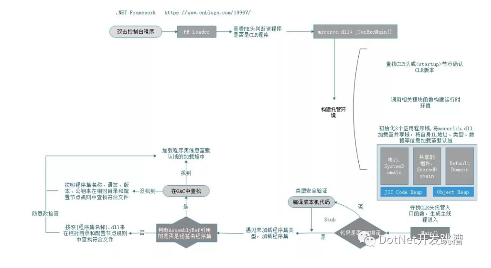
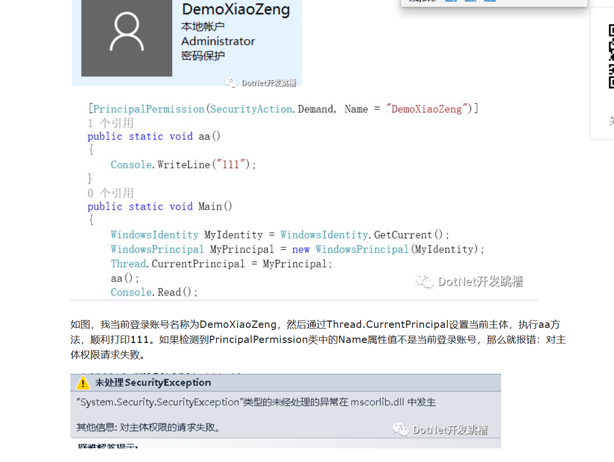
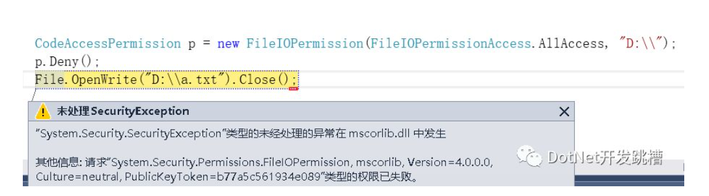
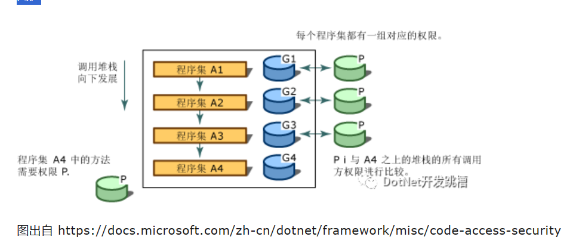

### 什么是托管代码，托管语言，托管模块？
```
.NET提供了一个垃圾回收器(GC)来完成这部分工作，当你创建类型的时候，它会自动给你分配所需要的这部分内存空间。就相当于，有一个专门的软件或进程，它会读取你的代码，然后当你执行这行代码的时候，它帮你做了内存分配工作。 这部分本该你做的工作，它帮你做了，这就是“托管”的概念。比如现实中 托管店铺、托管教育等这样的别人替你完成的概念。
```

### 什么是CLR，.NET虚拟机？ (Common Language Runtime)
```
 CLR公共语言运行库 (类型安全、应用程序域、异常机制等支持，这些)

 CLR是.NET类型系统的基础，所有的.NET技术都是建立在此之上。

 熟悉它可以帮助我们更好的理解框架组件的核心、原理。在我们执行托管代码之前，总会先运行这些运行库代码，通过运行库的代码调用，从而构成了一个用来支持托管程序的运行环境，进而完成诸如不需要开发人员手动管理内存，一套代码即可在各大平台跑的这样的操作。

 这套环境及体系之完善，以至于就像一个小型的系统一样，所以通常形象的称CLR为".NET虚拟机"。那么，如果以进程为最低端，进程的上面就是.NET虚拟机(CLR)，而虚拟机的上面才是我们的托管代码。换句话说，托管程序实际上是寄宿于.NET虚拟机中。

 所以C#编写的程序如果想运行就必须要依靠.NET提供的CLR环境来支持。 而CLR是.NET技术框架中的一部分，故只要在Windows系统中安装.NET Framework即可。

```

### 什么是程序集
```
上文我介绍了编译器，即将源代码文件给翻译成一个计算机可识别的二进制程序。

而在.NET Framework目录文件夹中就附带的有 用于C#语言的命令行形式的编译器csc.exe 和 用于VB语言的命令行形式的编译器vbc.exe。我们通过编译器可以将后缀为.cs(C#)和.vb(VB)类型的文件编译成程序集。

程序集是一个抽象的概念，不同的编译选项会产生不同形式的程序集。以文件个数来区分的话，那么就分 单文件程序集(即一个文件)和多文件程序集(多个文件)。

而不论是单文件程序集还是多文件程序集，其总有一个核心文件，就是表现为后缀为.dll或.exe格式的文件。它们都是标准的PE格式的文件，主要由4部分构成：


```

### IL代码(也称MSIL，后来被改名为CIL：Common Intermediate Language通用中间语言)
```
通用中间语言,是介于源代码和本机机器指令中间的代码，将通过CLR在不同的平台产生不同的二进制机器码。
```

### .NET程序执行原理
```
1.C#源码被编译成程序集，程序集内主要是由一些(元数据表)和(CIL)代码构成。
2.我们双击执行该exe，Windows加载器将该exe(PE格式文件)给映射到虚拟内存中，程序集的相关信息都会被加载至内存中，并查看PE文件的入口点(EntryPoint)并跳转至指定的mscoree.dll中_CorExeMain函数，该函数会执行一系列相关dll来构造CLR环境，当CLR预热后调用该程序集的入口方法Main()，接下来由CLR来执行托管代码(IL代码)。

```

### JIT编译(Just In Time Compiler) 在CLR下有一个用来将IL代码转换成机器码的引擎
```

前面说了，计算机最终只识别二进制的机器码，在CLR下有一个用来将IL代码转换成机器码的引擎，称为Just In Time Compiler，简称JIT，CLR总是先将IL代码按需通过该引擎编译成机器指令再让CPU执行，在这期间CLR会验证代码和元数据是否类型安全(在对象上只调用正确定义的操作、标识与声称的要求一致、对类型的引用严格符合所引用的类型)，被编译过的代码无需JIT再次编译，而被编译好的机器指令是被存在内存当中，当程序关闭后再打开仍要重新JIT编译。

```


### AOT编译 ( Ahead of Time Compilation 静态编译)
```
CLR的内嵌编译器是即时性的，这样的一个很明显的好处就是可以根据当时本机情况生成更有利于本机的优化代码，但同样的，每次在对代码编译时都需要一个预热的操作，它需要一个运行时环境来支持，这之间还是有消耗的。

而与即时编译所对应的，就是提前编译了，英文为Ahead of Time Compilation，简称AOT，也称之为静态编译。
在.NET中，使用Ngen.exe或者开源的.NET Native可以提前将代码编译成本机指令。

Ngen是将IL代码提前给全部编译成本机代码并安装在本机的本机映像缓存中，故而可以减少程序因JIT预热的时间，但同样的也会有很多注意事项，比如因JIT的丧失而带来的一些特性就没有了，如类型验证。Ngen仅是尽可能代码提前编译，程序的运行仍需要完整的CLR来支持。

.NET Native在将IL转换为本机代码的时候，会尝试消除所有元数据将依靠反射和元数据的代码替换为静态本机代码，并且将完整的CLR替换为主要包含垃圾回收器的重构运行时mrt100_app.dll。

.NET Native: https://docs.microsoft.com/zh-cn/dotnet/framework/net-native/ 
Ngen.exe：https://docs.microsoft.com/zh-cn/dotnet/framework/tools/ngen-exe-native-image-generator 
Ngen与.NET Native比较：https://www.zhihu.com/question/27997478/answer/38978762
```

## 程序集的规则
```
上文我通过ILDASM来描述CLR执行代码的方式，但还不够具体，还需要补充的是对于程序集的搜索方式。

对于System.Environment类型，它存在于mscorlib.dll程序集中，demo.exe是个独立的个体，它通过csc编译的时候只是注册了引用mscorlib.dll中的类型的引用信息，并没有记录mscorlib.dll在磁盘上的位置，那么，CLR怎么知道get_CurrentDirectory的代码？它是从何处读取mscorlib.dll的？ 
对于这个问题，.NET有个专门的概念定义，我们称为 程序集的加载方式。
```
### 程序集的加载方式
```
对于自身程序集内定义的类型，我们可以直接从自身程序集中的元数据中获取，对于在其它程序集中定义的类型，CLR会通过一组规则来在磁盘中找到该程序集并加载在内存。

CLR在查找引用的程序集的位置时候，第一个判断条件是 判断该程序集是否被签名。
什么是签名？
```

### 强名称程序集
```
就比如大家都叫张三，姓名都一样，喊一声张三不知道到底在叫谁。这时候我们就必须扩展一下这个名字以让它具有唯一性。

我们可以通过sn.exe或VS对项目右键属性在签名选项卡中采取RSA算法对程序集进行数字签名（加密：公钥加密，私钥解密。签名：私钥签名，公钥验证签名），会将构成程序集的所有文件通过哈希算法生成哈希值，然后通过非对称加密算法用私钥签名，最后公布公钥生成一串token，最终将生成一个由程序集名称、版本号、语言文化、公钥组成的唯一标识，它相当于一个强化的名称，即强名称程序集。 
mscorlib, Version=4.0.0.0, Culture=neutral, PublicKeyToken=b77a5c561934e089

我们日常在VS中的项目默认都没有被签名，所以就是弱名称程序集。强名称程序集是具有唯一标识性的程序集，并且可以通过对比哈希值来比较程序集是否被篡改，不过仍然有很多手段和软件可以去掉程序集的签名。

需要值得注意的一点是：当你试图在已生成好的强名称程序集中引用弱名称程序集，那么你必须对弱名称程序集进行签名并在强名称程序集中重新注册。 
之所以这样是因为一个程序集是否被篡改还要考虑到该程序集所引用的那些程序集，根据CLR搜索程序集的规则(下文会介绍)，没有被签名的程序集可以被随意替换，所以考虑到安全性，强名称程序集必须引用强名称程序集，否则就会报错：需要强名称程序集。

.NET Framework 4.5中对强签名的更改：https://docs.microsoft.com/zh-cn/dotnet/framework/app-domains/enhanced-strong-naming
```

### 项目的依赖顺序
```
如果没有通过config或者在代码中来设定CLR搜索程序集的规则，那么CLR就按照默认的也就是我上述所说的模式来寻找。
所以如果我们通过csc.exe来编译项目，引用了其它程序集的话，通常需要将那些程序集复制到同一目录下。故而每当我们通过VS编译器对项目右键重新生成项目(重新编译)时，VS都会将引用的程序集给复制一份到项目bin\输出目录Debug文件夹下，我们可以通过VS中对引用的程序集右键属性-复制本地 True/Flase 来决定这一默认行为。

值得一提的是，项目间的生成是有序生成的，它取决于项目间的依赖顺序。
比如Web项目引用BLL项目，BLL项目引用了DAL项目。那么当我生成Web项目的时候，因为我要注册Bll程序集，所以我要先生成Bll程序集，而BLL程序集又引用了Dal，所以又要先生成Dal程序集，所以程序集生成顺序就是Dal=>BLL=>Web，项目越多编译的时间就越久。

程序集之间的依赖顺序决定了编译顺序，所以在设计项目间的分层划分时不仅要体现出层级职责，还要考虑到依赖顺序。代码存放在哪个项目要有讲究，不允许出现互相引用的情况，比如A项目中的代码引用B，B项目中的代码又引用A。
```

### 为什么Newtonsoft.Json版本不一致？

```

A程序集中的Func方法调用了B程序集中的JsonObj方法，JsonObj方法又调用了Newtonsoft.Json 10.0程序集中的对象，那么当执行Func方法时程序就会异常，报System.IO.FileNotFoundException: 未能加载文件或程序集Newtonsoft.Json 10.0的错误。

这是为什么？
1.这是因为依赖顺序引起的。A引用了B，首先会先生成B，而B引用了 Newtonsoft.Json 10.0，那么VS就会将源引用文件(Newtonsoft.Json 10.0)复制到B程序集同一目录(bin/Debug)下，名为Newtonsoft.Json.dll文件，其内嵌程序集版本为10.0。
2.然后A引用了B，所以会将B程序集和B程序集的依赖项(Newtonsoft.Json.dll)给复制到A的程序集目录下，而A又引用了C盘的Newtonsoft.Json 6.0程序集文件，所以又将C:\Newtonsoft.Json.dll文件给复制到自己程序集目录下。因为两个Newtonsoft.Json.dll重名，所以直接覆盖了前者，那么只保留了Newtonsoft.Json 6.0。
3.当我们调用Func方法中的B.Convert()时候，CLR会搜索B程序集，找到后再调用 return Newtonsoft.Json.Obj 这行代码，而这行代码又用到了Newtonsoft.Json程序集，接下来CLR搜索Newtonsoft.Json.dll，文件名称满足，接下来CLR判断其标识，发现版本号是6.0，与B程序集清单里注册的10.0版本不符，故而才会报出异常：未能加载文件或程序集Newtonsoft.Json 10.0。

以上就是为何Newtonsoft.Json版本不一致会导致错误的原因，其也诠释了CLR搜索程序集的一个过程。
那么，如果我执意如此，有什么好的解决方法能让程序顺利执行呢？有，有2个方法。

第一种：通过bindingRedirect节点重定向，即当找到10.0的版本时，给定向到6.0版本
<runtime>
            <assemblyBinding xmlns="urn:schemas-microsoft-com:asm.v1">
                <dependentAssembly>
                    <assemblyIdentity name="Newtonsoft.Json"
                                      publicKeyToken="30ad4fe6b2a6aeed"
                                      culture="neutral" />
                    <bindingRedirect oldVersion="10.0.0.0"
                                     newVersion="6.0.0.0" />
                </dependentAssembly>
            </assemblyBinding>
</runtime>


```

### 如何在编译时加载两个相同的程序集？
```
注意：我看过有的文章里写的一个AppDomain只能加载一个相同的程序集，很多人都以为不能同时加载2个不同版本的程序集，实际上CLR是可以同时加载Newtonsoft.Json 6.0和Newtonsoft.Json 10.0的。

第二种：对每个版本指定codeBase路径，然后分别放上不同版本的程序集，这样就可以加载两个相同的程序集。
<runtime>
        <assemblyBinding xmlns="urn:schemas-microsoft-com:asm.v1">
            <dependentAssembly>
                <assemblyIdentity name="Newtonsoft.Json"
                                  publicKeyToken="30ad4fe6b2a6aeed"
                                  culture="neutral" />
                <codeBase version="6.0.0.0"
                          href="D:\6.0\Newtonsoft.Json.dll" />
            </dependentAssembly>
            <dependentAssembly>
                <assemblyIdentity name="Newtonsoft.Json"
                                  publicKeyToken="30ad4fe6b2a6aeed"
                                  culture="neutral" />
                <codeBase version="10.0.0.0"
                          href="D:\10.0\Newtonsoft.Json.dll" />
            </dependentAssembly>
        </assemblyBinding>
</runtime>


```

### 如何同时调用两个两个相同命名空间和类型的程序集？
```
除了程序集版本不同外，还有一种情况就是，我一个项目同时引用了程序集A和程序集B，但程序集A和程序集B中的命名空间和类型名称完全一模一样，这个时候我调用任意一个类型都无法区分它是来自于哪个程序集的，那么这种情况我们可以使用extern alias外部别名。
我们需要在所有代码前定义别名，extern alias a;extern alias b;，然后在VS中对引用的程序集右键属性-别名，分别将其更改为a和b(或在csc中通过/r:{别名}={程序集}.dll)。
在代码中通过 {别名}::{命名空间}.{类型}的方式来使用。
extern-alias介绍： 
https://docs.microsoft.com/zh-cn/dotnet/csharp/language-reference/keywords/extern-alias
```

### 共享程序集GAC (Global Assembly Cache)
```
我上面说了这么多有关CLR加载程序集的细节和规则，事实上，类似于mscorlib.dll、System.dll这样的FCL类库被引用的如此频繁，它已经是我们.NET编程中必不可少的一部分，几尽每个项目都会引用，为了不再每次使用的时候都复制一份，所以计算机上有一个位置专门存储这些我们都会用到的程序集，叫做全局程序集缓存(Global Assembly Cache,GAC)，

这个位置一般位于C:\Windows\Microsoft.NET\assembly和3.5之前版本的C:\Windows\assembly。

既然是共享存放的位置，那不可避免的会遇到文件名重复的情况，那么为了杜绝该类情况，规定在GAC中只能存在强名称程序集，每当CLR要加载强名称程序集时，会先通过标识去GAC中查找，而考虑到程序集文件名称一致但版本文化等复杂的情况，所以GAC有自己的一套目录结构。我们如果想将自己的程序集放入GAC中，那么就必须先签名，然后通过如gacutil.exe工具(其存在于命令行工具中 https://docs.microsoft.com/zh-cn/dotnet/framework/tools/developer-command-prompt-for-vs中)来注册至GAC中，值得一提的是在将强名称程序集安装在GAC中，会效验签名。

GAC工具： https://docs.microsoft.com/en-us/dotnet/framework/tools/gacutil-exe-gac-tool
```

### 延伸
```
CLR是按需加载程序集的，没有执行代码也就没有调用相应的指令，没有相应的指令，CLR也不会对其进行相应的操作。 当我们执行Environment.CurrentDirectory这段代码的时候，CLR首先要获取Environment类型信息，通过自身元数据得知其存在mscorlib.dll程序集中，所以CLR要加载该程序集，而mscorlib.dll又由于其地位特殊，早在CLR初始化的时候就已经被类型加载器自动加载至内存中，所以这行代码可以直接在内存中读取到类型的方法信息。
在这个章节，我虽然描述了CLR搜索程序集的规则，但事实上，加载程序集读取类型信息远远没有这么简单，这涉及到了属于.NET Framework独有的"应用程序域"概念和内存信息的查找。

简单延伸两个问题，mscorlib.dll被加载在哪里？内存堆中又是什么样的一个情况？
```

## 应用程序域
```
传统非托管程序是直接承载在Windows进程中，托管程序是承载在.NET虚拟机CLR上的，而在CLR中管控的这部分资源中，被分成了一个个逻辑上的分区，这个逻辑分区被称为应用程序域，是.NET Framework中定义的一个概念。

因为堆内存的构建和删除都通过GC去托管，降低了人为出错的几率，在此特性基础上.NET强调在一个进程中通过CLR强大的管理建立起对资源逻辑上的隔离区域，每个区域的应用程序互不影响，从而让托管代码程序的安全性和健壮性得到了提升。

熟悉程序集加载规则和AppDomain是在.NET技术下进行插件编程的前提。AppDomain这部分概念并不复杂。
当启动一个托管程序时，最先启动的是CLR，在这过程中会通过代码初始化三个逻辑区域，最先是SystemDomain系统程序域，然后是SharedDoamin共享域，最后是{程序集名称}Domain默认域。

系统程序域里维持着一些系统构建项，我们可以通过这些项来监控并管理其它应用程序域等。共享域存放着其它域都会访问到的一些信息，当共享域初始化完毕后，会自动加载mscorlib.dll程序集至该共享域。而默认域则用储存自身程序集的信息，我们的主程序集就会被加载至这个默认域中，执行程序入口方法，在没有特殊动作外所产生的一切耗费都发生在该域。

我们可以在代码中创建和卸载应用程序域，域与域之间有隔离性，挂掉A域不会影响到B域，并且对于每一个加载的程序集都要指定域的，没有在代码中指定域的话，默认都是加载至默认域中。
AppDomain可以想象成组的概念，AppDomain包含了我们加载的一组程序集。我们通过代码卸载AppDomain，即同时卸载了该AppDomain中所加载的所有程序集在内存中的相关区域。

AppDomain的初衷是边缘隔离，它可以让程序不重新启动而长时间运行，围绕着该概念建立的体系从而让我们能够使用.NET技术进行插件编程。

当我们想让程序在不关闭不重新部署的情况下添加一个新的功能或者改变某一块功能，我们可以这样做：将程序的主模块仍默认加载至默认域，再创建一个新的应用程序域，然后将需要更改或替换的模块的程序集加载至该域，每当更改和替换的时候直接卸载该域即可。 而因为域的隔离性，我在A域和B域加载同一个程序集，那么A域和B域就会各存在内存地址不同但数据相同的程序集数据。
```

### 跨边界访问
```
事实上，在开发中我们还应该注意跨域访问对象的操作(即在A域中的程序集代码直接调用B域中的对象)是与平常编程中有所不同的，一个域中的应用程序不能直接访问另一个域中的代码和数据，对于这样的在进程内跨域访问操作分两类。

事实上，在开发中我们还应该注意跨域访问对象的操作(即在A域中的程序集代码直接调用B域中的对象)是与平常编程中有所不同的，一个域中的应用程序不能直接访问另一个域中的代码和数据，对于这样的在进程内跨域访问操作分两类。

一是按引用封送，需要继承System.MarshalByRefObject，传递的是该对象的代理引用，与源域有相同的生命周期。

二是按值封送，需要被[Serializable]标记，是通过序列化传递的副本，副本与源域的对象无关。
无论哪种方式都涉及到两个域直接的封送、解封，所以跨域访问调用不适用于过高频率。
(比如，原来你是这样调用对象： var user=new User(); 现在你要这样：var user=(User){应用程序域对象实例}.CreateInstanceFromAndUnwrap("Model.dll","Model.User"); )

值得注意的是，应用程序域是对程序集的组的划分，它与进程中的线程是两个一横一竖，方向不一样的概念，不应该将这2个概念放在一起比较。我们可以通过Thread.GetDomain来查看执行线程所在的域。
应用程序域在类库中是System.AppDomain类,部分重要的成员有：

获取当前 System.Threading.Thread 的当前应用程序域
public static AppDomain CurrentDomain { get; }
使用指定的名称新建应用程序域
public static AppDomain CreateDomain(string friendlyName);
卸载指定的应用程序域。
public static void Unload(AppDomain domain);
指示是否对当前进程启用应用程序域的 CPU 和内存监视，开启后可以根据相关属性进行监控
public static bool MonitoringIsEnabled { get; set; }
当前域托管代码抛出异常时最先发生的一个事件，框架设计中可以用到
public event EventHandler<FirstChanceExceptionEventArgs> FirstChanceException;
当某个异常未被捕获时调用该事件，如代码里只catch了a异常，实际产生的是 b异常，那么b异常就没有捕捉到。
public event UnhandledExceptionEventHandler UnhandledException;
为指定的应用程序域属性分配指定值。该应用程序域的局部存储值，该存储不划分上下文和线程，均可通过GetData获取。
public void SetData(string name, object data);
如果想使用托管代码来覆盖CLR的默认行为https://msdn.microsoft.com/zh-cn/library/system.appdomainmanager(v=vs.85).aspx
public AppDomainManager DomainManager { get; }
返回域的配置信息，如在config中配置的节点信息
public AppDomainSetup SetupInformation { get; }

```

### AppDomain和AppPool
```
注意：此处的AppDomain应用程序域 和 IIS中的AppPool应用程序池 是2个概念，AppPool是IIS独有的概念，它也相当于一个组的概念，对网站进行划组，然后对组进行一些如进程模型、CPU、内存、请求队列的高级配置。
```

## 内存
```
应用程序域把资源给隔离开，这个资源，主要指内存。那么什么是内存呢？

要知道，程序运行的过程就是电脑不断通过CPU进行计算的过程，这个过程需要读取并产生运算的数据，为此我们需要一个拥有足够容量能够快速与CPU交互的存储容器，这就是内存了。对于内存大小，32位处理器，寻址空间最大为2的32次方byte，也就是4G内存，除去操作系统所占用的公有部分，进程大概能占用2G内存，而如果是64位处理器，则是8T。

而在.NET中，内存区域分为堆栈和托管堆。
```

### 堆栈和堆的区别
```
堆和堆栈就内存而言只不过是地址范围的区别。不过堆栈的数据结构和其存储定义让其在时间和空间上都紧密的存储，这样能带来更高的内存密度，能在CPU缓存和分页系统表现的更好。故而访问堆栈的速度总体来说比访问堆要快点。
```

### 线程堆栈
```
操作系统会为每条线程分配一定的空间，Windwos为1M，这称之为线程堆栈。在CLR中的栈主要用来执行线程方法时，保存临时的局部变量和函数所需的参数及返回的值等，

在栈上的成员不受GC管理器的控制，它们由操作系统负责分配，当线程走出方法后，该栈上成员采用后进先出的顺序由操作系统负责释放，执行效率高。

而托管堆则没有固定容量限制，它取决于操作系统允许进程分配的内存大小和程序本身对内存的使用情况，托管堆主要用来存放对象实例，不需要我们人工去分配和释放，其由GC管理器托管。
```

### 线程堆栈
```
操作系统会为每条线程分配一定的空间，Windwos为1M，这称之为线程堆栈。在CLR中的栈主要用来执行线程方法时，保存临时的局部变量和函数所需的参数及返回的值等，在栈上的成员不受GC管理器的控制，它们由操作系统负责分配，当线程走出方法后，该栈上成员采用后进先出的顺序由操作系统负责释放，执行效率高。
而托管堆则没有固定容量限制，它取决于操作系统允许进程分配的内存大小和程序本身对内存的使用情况，托管堆主要用来存放对象实例，不需要我们人工去分配和释放，其由GC管理器托管。

例如同样是在线性表中 "按顺序" 插入1,2,3,4

对于栈,只允许在尾部删除,所以先出栈的将会是4,即后进先出

对于队列,只允许在头部删除,所以先出队的是1,即先进先出

```

### 为什么值类型存储在栈上
```
不同的类型拥有不同的编译时规则和运行时内存分配行为，我们应知道，C# 是一种强类型语言，每个变量和常量都有一个类型，在.NET中，每种类型又被定义为值类型或引用类型。

使用 struct、enum 关键字直接派生于System.ValueType定义的类型是值类型，
使用 class、interface、delagate 关键字派生于System.Object定义的类型是引用类型。

C#中int关键字对应BCL中的Int32，short对应Int16。Int32为2的32位，如果把32个二进制数排列开来，我们要求既能表达正数也能表达负数，所以得需要其中1位来表达正负，首位是0则为+，首位是1则为-，那么我们能表示数据的数就只有31位了，而0是介于-1和1之间的整数，所以对应的Int32能表现的就是2的31次方到2的31次方-1，即2147483647和-2147483648这个整数段。

1个字节=8位，32位就是4个字节，像这种以Int32为代表的值类型，本身就是固定的内存占用大小，所以将值类型放在内存连续分配的栈中。

```

### 托管堆模型
```
而引用类型相比值类型就有点特殊，newobj创建一个引用类型，因其类型内的引用对象可以指向任何类型，故而无法准确得知其固定大小，所以像对于引用类型这种无法预知的容易产生内存碎片的动态内存，我们把它放到托管堆中存储。

托管堆由GC托管，其分配的核心在于堆中维护着一个nextObjPtr指针，我们每次实例(new)一个对象的时候，CLR将对象存入堆中，并在栈中存放该对象的起始地址，然后该指针都会根据该对象的大小来计算下一个对象的起始地址。不同于值类型直接在栈中存放值，引用类型则还需要在栈中存放一个代表(指向)堆中对象的值(地址)。

而托管堆又可以因存储规则的不同将其分类，托管堆可以被分为3类：

1.用于托管对象实例化的垃圾回收堆，又以存储对象大小分为小对象(<85000byte)的GC堆(SOH，Small Object Heap)和用于存储大对象实例的(>=85000byte)大对象堆(LOG，Larage Object Heap)。

2.用于存储CLR组件和类型系统的加载(Loader)堆，其中又以使用频率分为经常访问的高频堆(里面包含有MethodTables方法表, MeghodDescs方法描述, FieldDescs方法描述和InterfaceMaps接口图)，和较低的低频堆，和Stub堆(辅助代码，如JIT编译后修改机器代码指令地址环节)。

3.用于存储JIT代码的堆及其它杂项的堆。

而托管堆又可以因存储规则的不同将其分类，托管堆可以被分为3类：

1.用于托管对象实例化的垃圾回收堆，又以存储对象大小分为小对象(<85000byte)的GC堆(SOH，Small Object Heap)和用于存储大对象实例的(>=85000byte)大对象堆(LOG，Larage Object Heap)。

2.用于存储CLR组件和类型系统的加载(Loader)堆，其中又以使用频率分为经常访问的高频堆(里面包含有MethodTables方法表, MeghodDescs方法描述, FieldDescs方法描述和InterfaceMaps接口图)，和较低的低频堆，和Stub堆(辅助代码，如JIT编译后修改机器代码指令地址环节)。

3.用于存储JIT代码的堆及其它杂项的堆。

加载程序集就是将程序集中的信息给映射在加载堆，对产生的实例对象存放至垃圾回收堆。前文说过应用程序域是指通过CLR管理而建立起的逻辑上的内存边界，那么每个域都有其自己的加载堆，只有卸载应用程序域的时候，才会回收该域对应的加载堆。

而加载堆中的高频堆包含的有一个非常重要的数据结构表---方法表，每个类型都仅有一份方法表(MethodTables)，它是对象的第一个实例创建前的类加载活动的结果，它主要包含了我们所关注的3部分信息：

1包含指向EEClass的一个指针。EEClass是一个非常重要的数据结构，当类加载器加载到该类型时会从元数据中创建出EEClass，EEClass里主要存放着与类型相关的表达信息。

2包含指向各自方法的方法描述器(MethodDesc)的指针逻辑组成的线性表信息:继承的虚函数, 新虚函数, 实例方法, 静态方法。

3包含指向静态字段的指针。

那么，实例一个对象，CLR是如何将该对象所对应的类型行为及信息的内存位置(加载堆)关联起来的呢？
```

### 选class还是struct
```
那么我到底是该new一个class呢还是选择struct呢？

通过上文知道对于class，用完之后对象仍然存在托管堆，占用内存。对于struct，用完之后直接由操作系统销毁。那么在实际开发中定义类型时，选择class还是struct就需要注意了，要综合应用场景来辨别。struct存在于栈上，栈和托管堆比较，最大的优势就是即用即毁。所以如果我们单纯的传递一个类型，那么选择struct比较合适。但须注意线程堆栈有容量限制，不可多存放超大量的值类型对象，并且因为是值类型直接传递副本，所以struct作为方法参数是线程安全的，但同样要避免装箱的操作。而相比较class，如果类型中还需要多一些封装继承多态的行为，那么class当然是更好的选择。
```

### GC管理器
```
值得注意的是，当我new完一个对象不再使用的时候，这个对象在堆中所占用的内存如何处理？
在非托管世界中，可以通过代码手动进行释放，但在.NET中，堆完全由CLR托管，也就是说GC堆是如何具体来释放的呢？

当GC堆需要进行清理的时候，GC收集器就会通过一定的算法来清理堆中的对象，并且版本不同算法也不同。最主要的则为Mark-Compact标记-压缩算法。
这个算法的大概含义就是，通过一个图的数据结构来收集对象的根，这个根就是引用地址，可以理解为指向托管堆的这根关系线。当触发这个算法时，会检查图中的每个根是否可达，如果可达就对其标记，然后在堆上找到剩余没有标记(也就是不可达)的对象进行删除，这样，那些不在使用的堆中对象就删除了。

前面说了，因为nextObjPtr的缘故，在堆中分配的对象都是连续分配的，因为未被标记而被删除，那么经过删除后的堆就会显得支零破碎，那么为了避免空间碎片化，所以需要一个操作来让堆中的对象再变得紧凑、连续，而这样一个操作就叫做：Compact压缩。 
而对堆中的分散的对象进行挪动后，还会修改这些被挪动对象的指向地址，从而得以正确的访问，最后重新更新一下nextObjPtr指针，周而复始。

而为了优化内存结构，减少在图中搜索的成本，GC机制又为每个托管堆对象定义了一个属性，将每个对象分成了3个等级，这个属性就叫做：代，0代、1代、2代。

每当new一个对象的时候，该对象都会被定义为第0代，当GC开始回收的时候，先从0代回收，在这一次回收动作之后，0代中没有被回收的对象则会被定义成第1代。当回收第1代的时候，第1代中没有被清理掉的对象就会被定义到第2代。 
CLR初始化时会为0/1/2这三代选择一个预算的容量。0代通常以256 KB-4 MB之间的预算开始，1代的典型起始预算为512 KB-4 MB，2代不受限制，最大可扩展至操作系统进程的整个内存空间。

比如第0代为256K，第1代为2MB。我们不停的new对象，直到这些对象达到256k的时候，GC会进行一次垃圾回收，假设这次回收中回收了156k的不可达对象，剩余100k的对象没有被回收，那么这100k的对象就被定义为第1代。现在就变成了第0代里面什么都没有，第1代里放的有100k的对象。这样周而复始，GC清除的永远都只有第0代对象，除非当第一代中的对象累积达到了定义的2MB的时候，才会连同清理第1代，然后第1代中活着的部分再升级成第二代...

第二代的容量是没有限制，但是它有动态的阈值(因为等到整个内存空间已满以执行垃圾回收是没有意义的)，当达到第二代的阈值后会触发一次0/1/2代完整的垃圾收集。

也就是说，代数越长说明这个对象经历了回收的次数也就越多，那么也就意味着该对象是不容易被清除的。 
这种分代的思想来将对象分割成新老对象，进而配对不同的清除条件，这种巧妙的思想避免了直接清理整个堆的尴尬。


```

### 弱引用、弱事件
```
GC收集器会在第0代饱和时开始回收托管堆对象，对于那些已经申明或绑定的不经访问的对象或事件，因为不经常访问而且还占内存(有点懒加载的意思)，所以即时对象可达，但我想在GC回收的时候仍然对其回收，当需要用到的时候再创建，这种情况该怎么办？

那么这其中就引入了两个概念：
WeakReference弱引用、WeakEventManager弱事件
对于这2两个不区分语言的共同概念，大家可自行扩展百度，此处就不再举例。
```

### GC堆回收
```
那么除了通过new对象而达到代的阈(临界)值时，还有什么能够导致垃圾堆进行垃圾回收呢？ 还可能windows报告内存不足、CLR卸载AppDomain、CLR关闭等其它特殊情况。

或者，我们还可以自己通过代码调用。

.NET有GC来帮助开发人员管理内存，并且版本也在不断迭代。GC帮我们托管内存，但仍然提供了System.GC类让开发人员能够轻微的协助管理。 这其中有一个可以清理内存的方法(并没有提供清理某个对象的方法)：GC.Collect方法，可以对所有或指定代进行即时垃圾回收(如果想调试，需在release模式下才有效果)。这个方法尽量别用，因为它会扰乱代与代间的秩序，从而让低代的垃圾对象跑到生命周期长的高代中。

GC还提供了，判断当前对象所处代数、判断指定代数经历了多少次垃圾回收、获取已在托管堆中分配的字节数这样的三个方法，我们可以从这3个方法简单的了解托管堆的情况。

托管世界的内存不需要我们打理，我们无法从代码中得知具体的托管对象的大小，你如果想追求对内存最细微的控制，显然C#并不适合你，不过类似于有关内存把控的这部分功能模块，我们可以通过非托管语言来编写，然后通过.NET平台的P/Invoke或COM技术(微软为CLR定义了COM接口并在注册表中注册)来调用。

像FCL中的源码，很多涉及到操作系统的诸如 文件句柄、网络连接等外部extren的底层方法都是非托管语言编写的，对于这些非托管模块所占用的资源，我们可以通过隐式调用析构函数(Finalize)或者显式调用的Dispose方法通过在方法内部写上非托管提供的释放方法来进行释放。

像文中示例的socket就将释放资源的方法写入Dispose中，析构函数和Close方法均调用Dispose方法以此完成释放。事实上，在FCL中的使用了非托管资源的类大多都遵循IDispose模式。而如果你没有释放非托管资源直接退出程序，那么操作系统会帮你释放该程序所占的内存的。
```

### 垃圾回收对性能的影响
```
还有一点，垃圾回收是对性能有影响的。
GC虽然有很多优化策略，但总之，只要当它开始回收垃圾的时候，为了防止线程在CLR检查期间对对象更改状态，所以CLR会暂停进程中的几乎所有线程(所以线程太多也会影响GC时间)，而暂停的时间就是应用程序卡死的时间，为此，对于具体的处理细节，GC提供了2种配置模式让我们选择。

第一种为：单CPU的工作站模式，专为单CPU处理器定做。这种模式会采用一系列策略来尽可能减少GC回收中的暂停时间。 
而工作站模式又分为并发(或后台)与不并发两种，并发模式表现为响应时间快速，不并发模式表现为高吞吐量。

第二种为：多CPU的服务器模式，它会为每个CPU都运行一个GC回收线程，通过并行算法来使线程能真正同时工作，从而获得性能的提升。

我们可以通过在Config文件中更改配置来修改GC模式，如果没有进行配置，那么应用程序总是默认为单CPU的工作站的并发模式，并且如果机器为单CPU的话，那么配置服务器模式则无效。

如果在工作站模式中想禁用并发模式，则应该在config中运行时节点添加 <gcConcurrent enabled="false" /> 
如果想更改至服务器模式，则可以添加 <gcServer enabled="true" />。

 <configuration>
        <runtime>
            <!--<gcConcurrent enabled="true|false"/>-->
            <!--<gcServer enabled="true|false"/>-->
        </runtime>
</configuration>
```

### 性能建议
```
虽然我们可以选择适合的GC工作模式来改善垃圾回收时的表现，但在实际开发中我们更应该注意减少不必要的内存开销。

几个建议是，减换需要创建大量的临时变量的模式、考虑对象池、大对象使用懒加载、对固定容量的集合指定长度、注意字符串操作、注意高频率的隐式装箱操作、延迟查询、对于不需要面向对象特性的类用static、需要高性能操作的算法改用外部组件实现(p/invoke、com)、减少throw次数、注意匿名函数捕获的外部对象将延长生命周期、可以阅读GC相关运行时配置在高并发场景注意变换GC模式...

对于.NET中改善性能可延伸阅读 https://msdn.microsoft.com/zh-cn/library/ms973838.aspx 、 https://msdn.microsoft.com/library/ms973839.aspx
```

### .NET程序执行图
##### 至此，.NET Framework上的三个重要概念，程序集、应用程序域、内存在本文讲的差不多了，我画了一张图简单的概述.NET程序的一个执行流程：



## .NET的安全性
##### .NET Framework中的安全机制分为 基于角色的安全机制 和 代码访问安全机制 

#### 基于角色的安全性

```
基于角色的安全机制作为传统的访问控制，其运用的非常广泛，如操作系统的安全策略、数据库的安全策略等等...它的概念就相当于我们经常做的那些RBAC权限管理系统一样，用户关联角色，角色关联权限，权限对应着操作。
整个机制的安全逻辑就和我们平时编写代码判断是一样的，大致可以分为两个步骤.

第一步就是创建一个主体，然后标识这个主体是什么身份(角色) ，第二步就是 身份验证，也就是if判断该身份是否可以这样操作。

而在.NET Framework中，这主体可以是Windows账户，也可以是自定义的标识，通过生成如当前线程或应用程序域使用的主体相关的信息来支持授权。
比如，构造一个代表当前登录账户的主体对象WindowsPrincipal，然后通过 AppDomain.CurrentDomain.SetThreadPrincipal(主体对象);或Thread.CurrentPrincipal的set方法来设置应用程序域或线程的主体对象， 最后使用System.Security.Permissions.PrincipalPermission特性来标记在方法上来进行授权验证。

在官方文档中有对.NET Framework基于角色的安全性的详细的介绍，感兴趣可以去了解 https://docs.microsoft.com/zh-cn/dotnet/standard/security/principal-and-identity-objects#principal-objects
```

### 代码访问安全性
```
在.NET Framework中还有一个安全策略，叫做 代码访问安全Code Access Security，也就是CAS了。

代码访问安全性在.NET Framework中是用来帮助限制代码对受保护资源和操作的访问权限。
举个例子，我通过创建一个FileIOPermission对象来限制对后续代码对D盘的文件和目录的访问，如果后续代码对D盘进行资源操作则报错。 

FileIOPermission是代码控制访问文件和文件夹的能力。除了FileIOPermission外，还有如PrintingPermission代码控制访问打印机的权限、RegistryPermission代码控制操作注册表的权限、SocketPermission控制接受连接或启动Socket连接的权限。 

对于这些通过代码来对受保护资源和操作的权限限制，也就是这些类名后缀为Permission的类，它们叫做 Permissions(权限)，都继承自CodeAccessPermission，都有如Demand，Assert，Deny，PermitOnly，IsSubsetOf，Intersect和Union这些方法，在MSDN上有完整的权限列表：https://msdn.microsoft.com/en-us/library/h846e9b3(v=vs.100).aspx

为了确定代码是否有权访问某一资源或执行某一操作，CLR的安全系统将审核调用堆栈，以将每个调用方获得的权限与要求的权限进行比较。 如果调用堆栈中的任何调用方不具备要求的权限，则会引发安全性异常并拒绝访问。

而除了Permissions权限，代码访问安全性机制还有 权限集、证据、代码组、策略等概念。这些概念让CAS如此强大，但相应的，它们也让CAS变得复杂，必须为每个特定机器定义正确的PermissionSet和Code Groups才能设置成一个成功的CAS策略。

考虑到这层原因，Microsoft .NET安全小组决定从头开始重建代码访问安全性。在.NET Framework4.0之后，就不再使用之前的那套CAS模型了，而是使用.NET Framework 2.0中引入的安全透明模型，然后稍加修改，修改后的安全透明模型成为保护资源的标准方法，被称之为：安全透明度级别2

安全透明度2介绍：https://msdn.microsoft.com/en-us/library/dd233102(v=vs.100).aspx
.NET Framework4.0的安全更改：https://msdn.microsoft.com/en-us/library/dd233103(v=vs.100).aspx 
一个完整的CAS演示：https://www.codeproject.com/Articles/5724/Understanding-NET-Code-Access-Security

对于安全透明度级别2我将不再介绍，感兴趣的可以看我推荐的这2篇文章，对Level2的安全透明度介绍的比较详细，包括实践、迁移。 
https://www.red-gate.com/simple-talk/dotnet/.net-framework/whats-new-in-code-access-security-in-.net-framework-4.0---part-i/
https://www.red-gate.com/simple-talk/dotnet/net-framework/whats-new-in-code-access-security-in-net-framework-4-0-part-2/
```



## .NET是什么
```
NET是一个微软搭造的开发者平台，它主要包括：

1.支持(面向)该平台的编程语言(如C#、Visual Basic、C++/CLI、F#、IronPython、IronRuby...)，

2.用于该平台下开发人员的技术框架体系(.NET Framework、.NET Core、Mono、UWP等)，

1.定义了通用类型系统，庞大的CTS体系

2.用于支撑.NET下的语言运行时的环境：CLR

3..NET体系技术的框架库FCL

3.用于支持开发人员开发的软件工具(即SDK，如VS2017、VS Code等)
```

### .NET Framework是什么
```
事实上，像我上面讲的那些诸如程序集、GC、AppDomain这样的为CLR的一些概念组成，实质上指的是.NET Framework CLR。

.NET平台是微软为了占据开发市场而成立的，不是无利益驱动的纯技术平台的那种东西。基于该平台下的技术框架也因为 商业间的利益 从而和微软自身的Windows操作系统所绑定。所以虽然平台雄心和口号很大，但很多框架类库技术都是以Windows系统为蓝本，这样就导致，虽然.NET各方面都挺好，但是用.NET就必须用微软的东西，直接形成了技术-商业的绑定。

.NET Framework就是.NET 技术框架组成在Windows系统下的具体的实现，和Windows系统高度耦合，上文介绍的.NET系统，就是指.NET Framework。

部署.net Framework ：https://docs.microsoft.com/zh-cn/dotnet/framework/deployment/deployment-guide-for-developers 

.NET Framework高级开发：https://docs.microsoft.com/en-us/previous-versions/visualstudio/visual-studio-2008/29eafad8(v%3dvs.90) 

.NET Framework源码在线浏览：https://referencesource.microsoft.com/
```

### 如何在VS中调试.NET Framework源代码
```
最为关键的是pdb符号文件，没得符号就调不了，对于符号我们从微软的符号服务器上下载(默认就已配置)，还得有源代码来调试。

点击工具-选项-调试-常规，如果你之前没有在该配置栏配置过，那么你就勾选 启用源服务器支持 、启用.net Framework源代码单步执行，然后将 要求源文件与原始版本完全匹配 给取消掉。

然后就是下载pdb符号文件了，如果想直接下载那么可以在调试-符号这栏 将Microsoft符号服务器给勾上 。如果想按需下载，那么在调试的时候，可以点击调试-窗口 选择 模块/调用堆栈 来选择自己想加载的去加载。

然后至 https://referencesource.microsoft.com/网站 点击右上角下载源代码。当你调试代码的时候，会提示你无可用源，这个时候你再将你下载下来的源码文件给浏览查找一下就可以了。

如何配置VS来调试.NET Framework源码： https://referencesource.microsoft.com/#q=web 、 https://technet.microsoft.com/zh-cn/cc667410.aspx

还一种方法是，下载.NET Reflector插件，该插件可以帮助我们在VS中直接调试dll，这种方式操作非常简单，不过该插件收费，具体的可以查看我之前写过的文章(群里有该插件的注册版)
```


### .NET Core是什么
```
有丑才有美，有低才有高，概念是比较中诞生的。.NET Core就是如此，它是其它操作系统的.NET Framework翻版实现。

操作系统不止Windows，还有Mac和类Linux等系统， .NET的实现 如果按操作系统来横向分割的话，可以分为 Windows系统下的 .NET Framework 和 兼容多个操作系统的 .NET Core。

我们知道，一个.NET程序运行核心在于.NET CLR，为了能让.NET程序在其它平台上运行，一些非官方社区和组织为此开发了在其它平台下的.NET实现（最为代表的是mono，其团队后来又被微软给合并了 ），但因为不是官方，所以在一些方面多少有些缺陷(如FCL)，后来微软官方推出了.NET Core，其开源在Github中，并被收录在NET基金会(.NET Foundation，由微软公司成立与赞助的独立自由软件组织，其目前收录包括.NET编译器平台("Roslyn")以及ASP.NET项目系列，.NET Core，Xamarin Forms以及其它流行的.NET开源框架)，旨在真正的 .NET跨平台。

.NET Core是.NET 技术框架组成在Windows.macOS.Linux系统下的具体的实现。
.NET Core是一个开源的项目，其由 Microsoft 和 GitHub 上的 .NET 社区共同维护，但 这份工作仍然是巨大的，因为在早期对.NET上的定义及最初的实现一直是以Windows系统为参照及载体，一些.NET机制实际上与Windows系统耦合度非常高，有些属于.NET自己体系内的概念，有些则属于Windows系统api的封装。 那么从Windows转到其它平台上，不仅要实现相应的CLR，还要舍弃或重写一部分BCL，因而，.NET Core在概念和在项目中的行为与我们平常有些不同。

比如，NET Core不支持AppDomains、远程处理、代码访问安全性 (CAS) 和安全透明度，任何有关该概念的库代码都应该被替换。 
这部分代码它不仅指你项目中的代码，还指你项目中using的那些程序集代码，所以你会在github上看到很多开源项目都在跟进对.NET Core的支持,并且很多开发者也尝试学习.NET Core，这也是一种趋势。

.NET Core指南https://docs.microsoft.com/en-us/dotnet/core/
.NET基金会：https://dotnetfoundation.org 
.NET Core跨平台的行为变更：https://github.com/dotnet/corefx/wiki/ApiCompat 
微软宣布.NET开发环境将开源 ：https://news.cnblogs.com/n/508410/
```

### .NET Standard是什么
```
值得一提的是微软还为BCL提出了一个标准，毕竟各式各样的平台，技术层出不穷，为了防止.NET在类库方面的碎片化，即提出了一套正式的 .NET API (.NET 的应用程序编程接口)规范，.NET Standard。

正如上面CLS一样，.NET Standard就类似于这样的一个概念，无论是哪个托管框架，我们遵循这个标准，就能始终保持在BCL的统一性，即我不需要关心我是用的.NET Framework还是.NET Core，只要该类被定义于.NET Standard中，我就一定能在对应支持的.NET Standard的版本的托管框架中找到它。

.NET Standard： https://docs.microsoft.com/zh-cn/dotnet/standard/net-standard#net-implementation-support

.NET Standard开源代码：https://github.com/dotnet/standard
```


### .NET官方开源项目链接
```
现在我将给出.NET相关的开源项目地址：
参与.NET和.NET开源项目的起点：https://github.com/Microsoft/dotnet

.NET Core：https://github.com/dotnet/core

.NET Core文档：https://github.com/dotnet/docs

ASP.NET Core：https://github.com/aspnet/home

ASP.NET Core文档：https://github.com/aspnet/Docs

EntityFramework Core框架:https://github.com/aspnet/EntityFrameworkCore

ASP.NET Core MVC框架：https://github.com/aspnet/Mvc

EntityFramework6:https://github.com/aspnet/EntityFramework6

.NET Framework源码：https://github.com/microsoft/referencesource

.NET Core基类库：https://github.com/dotnet/corefx

.NET Core CLR：https://github.com/dotnet/coreclr

Roslyn编译器：https://github.com/dotnet/roslyn

MVC5、Web API2、Web Pages3框架源码：https://github.com/aspnet/AspNetWebStack

.NET Standard：https://github.com/dotnet/standard

KestrelHttpServer用于ASP.NET Core的跨平台Web服务器：https://github.com/aspnet/KestrelHttpServer

Visual Studio Code源码：https://github.com/Microsoft/vscode

一些优秀的.NET库、工具、框架、软件开源集合：https://github.com/quozd/awesome-dotnet

一些常用框架对ASP.NET Core和.NET Core的支持报告：https://github.com/jpsingleton/ANCLAFS

一些.NET下用于支持开发的开源项目集合：https://github.com/Microsoft/dotnet/blob/master/dotnet-developer-projects.md

微软出品的分布式框架orleans：https://github.com/dotnet/orleans

ML.NET 用于.NET的开源和跨平台机器学习框架：https://github.com/dotnet/machinelearning
```

## 原文链接
```
http://www.cnblogs.com/1996V/p/9037603.html
```